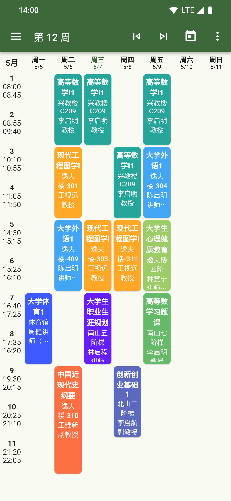
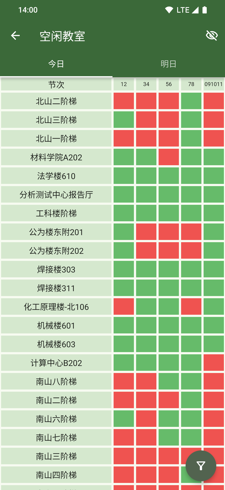
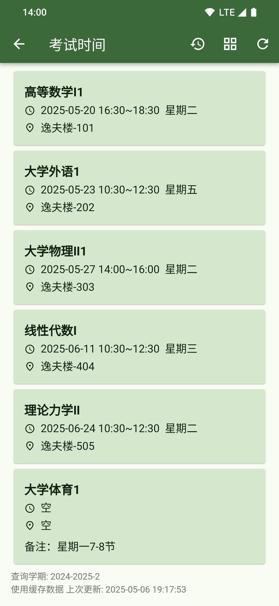
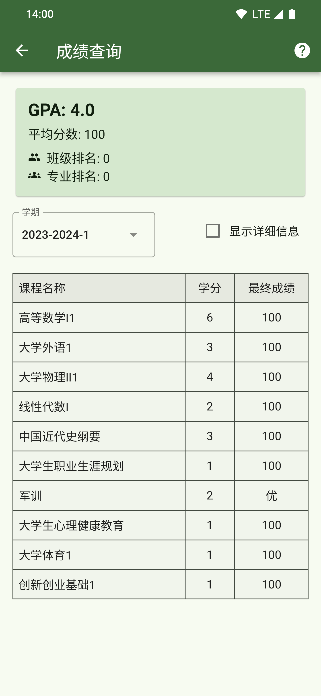
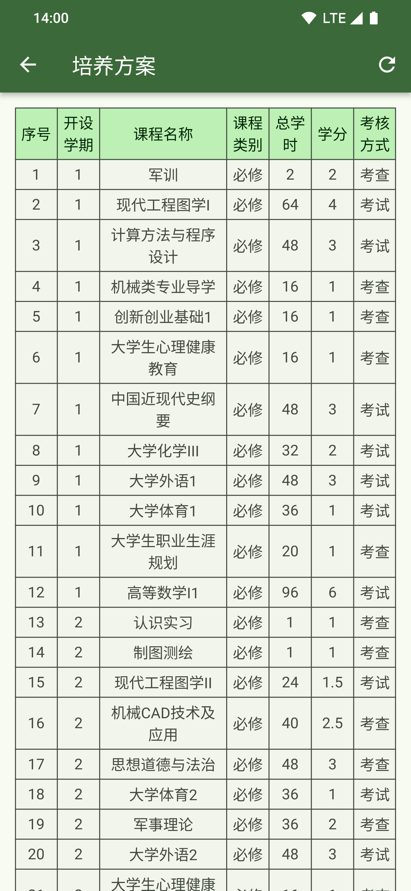
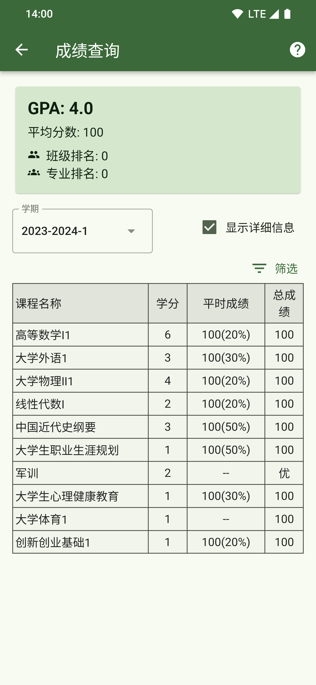
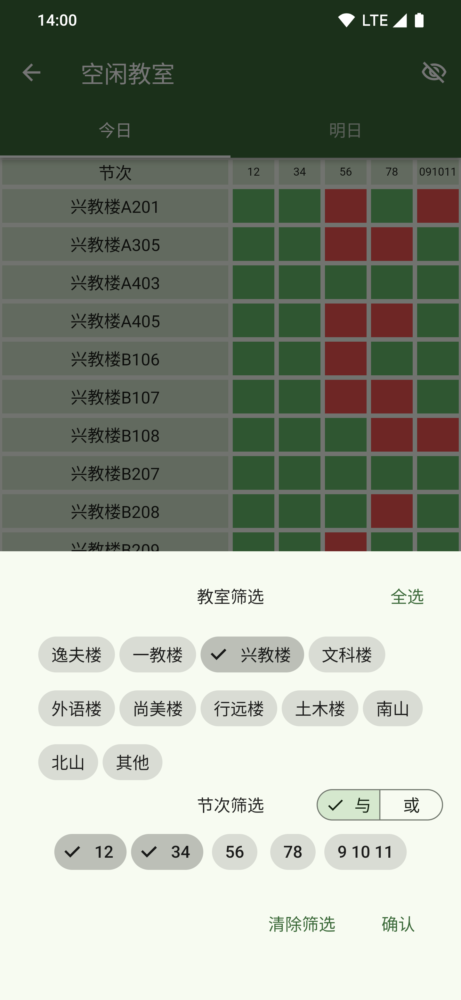
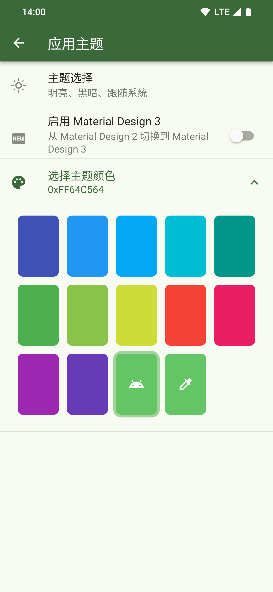
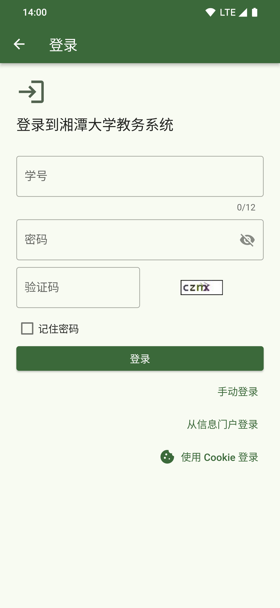

# Sachet

<p align="center">
  
</p>

<p align="center">
  <a href="https://github.com/zzy00747/sachet/releases">
    
  </a>
  <a href="https://github.com/zzy00747/sachet/blob/main/LICENSE">
    
  </a>
  <a href="https://flutter.dev">
    
  </a>
</p>

**Sachet** 是一款专为**湘潭大学**学生打造的第三方校园助手应用，提供课程表、空闲教室查询、考试安排、成绩查询、培养方案等常用功能。本应用基于 [Flutter](https://flutter.dev) 开发，支持 Android、Windows、Linux 等多个平台。

> 💡 **本项目 Fork 自 [wyvern1723/sachet](https://github.com/wyvern1723/sachet)，感谢原作者 [wyvern1723](https://github.com/wyvern1723) 的出色工作！**

---

## ✨ 功能特性

- 📅 **课程表**
  - 从新正方教务系统自动导入课表
  - 支持周视图、月视图、学期视图
  - 支持课程卡片高度缩放手势
  - 支持导出为 `.ics` 日历文件
  - 支持上课前本地通知提醒
  - 支持课程配色自定义

- 🏫 **空闲教室**
  - 快速查询今日/明日空闲教室
  - 支持自选日期和自定义节次分段
  - 可查看全天空闲状态

- 📝 **考试信息**
  - 查询考试时间与考场安排
  - 显示考试倒计时
  - 支持长按复制考试信息

- 📊 **成绩查询**
  - 查询各学期考试成绩
  - 自动计算 GPA
  - 支持查看成绩单 PDF

- 📚 **培养方案**
  - 查看个人培养方案
  - 支持查看其他专业培养方案

- 🎨 **个性化**
  - 支持 Android 动态取色（Material You）
  - 可选 Material Design 2 / Material Design 3
  - 多种导航方式：底部导航栏、侧边导航栏、抽屉导航栏
  - 自定义主题色、页面过渡动画

- 🔒 **安全与隐私**
  - 账号密码本地加密存储
  - 不主动收集任何个人信息
  - 直接与教务系统服务器通信

---

## 📸 应用截图

<p align="center">
  
  
  
  
</p>

<p align="center">
  
  
  
  
</p>

<p align="center">
  
</p>

---

## ⬇️ 下载安装

- **GitHub Releases**：<https://github.com/zzy00747/sachet/releases>

目前主要提供：

- Android APK（按 ABI 拆分，包含 `arm64-v8a`、`armeabi-v7a` 等）
- Windows 安装包/可执行文件
- Linux 可执行文件

> **注意**：本应用为第三方独立开发，与湘潭大学官方机构无关。

---

## 🛠️ 技术栈

- **框架**：[Flutter](https://flutter.dev) 3.24.5
- **开发语言**：Dart 3.5.4
- **状态管理**：[Provider](https://pub.dev/packages/provider)
- **网络请求**：[Dio](https://pub.dev/packages/dio)、[http](https://pub.dev/packages/http)
- **数据解析**：[html](https://pub.dev/packages/html)
- **本地存储**：`shared_preferences`、`flutter_secure_storage`、`path_provider`
- **本地通知**：[flutter_local_notifications](https://pub.dev/packages/flutter_local_notifications)
- **应用内 WebView**：[flutter_inappwebview](https://pub.dev/packages/flutter_inappwebview)
- **动态取色**：[dynamic_color](https://pub.dev/packages/dynamic_color)
- **PDF 查看**：[pdfx](https://pub.dev/packages/pdfx)

---

## 🚀 快速开始

### 环境要求

- **Flutter**: 3.24.5（建议使用 [FVM](https://fvm.app) 管理版本）
- **Dart**: 3.5.4
- **JDK**: 17
- **Android SDK**: 35（如需要编译 Android 版本）

### 克隆项目

```bash
git clone https://github.com/zzy00747/sachet.git
cd sachet
```

### 安装依赖

```bash
flutter pub get
```

### 运行应用

```bash
flutter run
```

### 构建 Release 版本

#### Android APK

```bash
flutter build apk --release --target-platform android-arm64
```

#### Windows

```bash
flutter build windows
```

#### Linux

```bash
flutter build linux
```

> 更详细的构建说明、平台依赖和常见问题，请参考 [`README_DEV.md`](./README_DEV.md)。

---

## 📁 项目结构

```
lib/
├── constants/        # 常量（应用信息、主题色、URL 等）
├── models/           # 数据模型
├── pages/            # 应用页面
├── providers/        # Provider 状态管理
├── services/         # 业务服务（登录、教务数据获取等）
├── utils/            # 工具类与封装
└── widgets/          # 可复用组件
```

更多细节请参阅 [`README_DEV.md`](./README_DEV.md) 中的项目文件树说明。

---

## 📜 更新日志

详见 [`CHANGELOG.md`](./CHANGELOG.md)。

---

## 🤝 贡献

欢迎提交 Issue 和 Pull Request！

1. Fork 本仓库
2. 创建你的特性分支：`git checkout -b feature/AmazingFeature`
3. 提交改动：`git commit -m 'Add some AmazingFeature'`
4. 推送分支：`git push origin feature/AmazingFeature`
5. 创建 Pull Request

---

## ⚠️ 免责声明

1. 本软件由第三方独立开发，仅调用教务系统服务器的数据，**与湘潭大学官方机构无关**。
2. 本软件**不主动收集任何个人信息**，通过加密协议直接与教务系统通信。账号信息在本地加密存储，**不上传至任何第三方服务器**。
3. 本软件**提供的信息仅供参考，不保证实时性或准确性**，请以官方平台的数据为准。
4. 本软件仅用于信息查询，所有操作均不涉及数据修改或上传。
5. 本软件为免费且开源软件，遵循 [MIT 协议](https://opensource.org/license/mit) 发布，**对应用的运行情况不作任何形式的担保**。

---

## 🙏 致谢

本项目基于 [wyvern1723/sachet](https://github.com/wyvern1723/sachet) Fork 而来，感谢原作者 [wyvern1723](https://github.com/wyvern1723) 开发并开源了如此优秀的作品。

---

## 📄 许可证

本项目基于 [MIT 许可证](./LICENSE) 开源。

---

## 📮 联系方式

- **原作者**：[@wyvern1723](https://github.com/wyvern1723)
  - 邮箱：wyvern1723@outlook.com
- **二次开发作者**：[@zzy00747](https://github.com/zzy00747)
  - 邮箱：voidsec@126.com / voidsec@foxmail.com
- **项目仓库**：[zzy00747/SachetNew](https://github.com/zzy00747/SachetNew)
