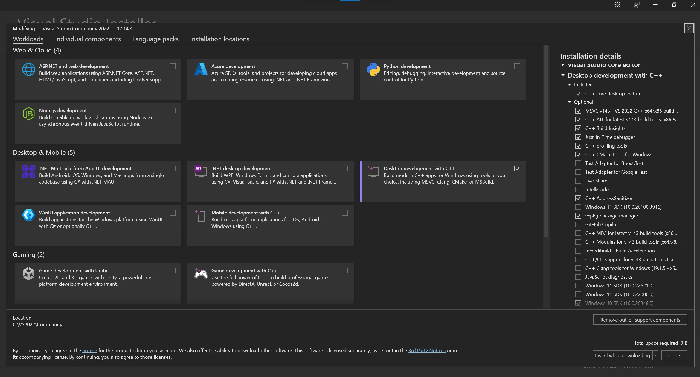
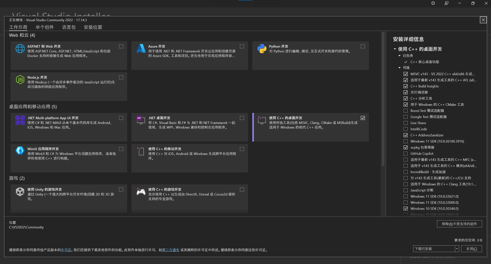

# README_DEV.md

## 开发环境

- **Flutter**: 3.24.5
- **JDK**: 17
- **Android SDK**: 35

## 构建该软件

### 配置 Flutter 开发环境

根据 [Flutter 官网的指导](https://docs.flutter.dev/get-started/install) 配置 Flutter 开发环境，并成功运行示例的 Counter App。

若要编译 Android 版本，请确保 `flutter doctor` 的输出中 Flutter、Android toolchain、Android Studio 配置正确（状态为绿色的 `✓`）。

> [!NOTE]
> 本项目使用的 Flutter 版本为 3.24.5, ~~可能~~不兼容最新版本的 Flutter SDK。
>
> 可能的解决方法：
>
> - 使用 [FVM](https://fvm.app) 管理 Flutter 版本（配置可能较复杂，但 FVM 是长期开发 Flutter 软件中非常实用的工具）。
> - 将 Flutter 降级至项目使用的版本。

### Windows

#### Windows 上的环境参考

<details>
<summary><code>flutter doctor -v</code> 输出：</summary>

```txt
$ flutter doctor -v

[√] Flutter (Channel stable, 3.24.5, on Microsoft Windows [版本 10.0.19044.5487], locale zh-CN)
    • Flutter version 3.24.5 on channel stable at C:\Users\You\fvm\versions\3.24.5
    • Upstream repository https://github.com/flutter/flutter.git
    • Framework revision dec2ee5c1f (7 months ago), 2024-11-13 11:13:06 -0800
    • Engine revision a18df97ca5
    • Dart version 3.5.4
    • DevTools version 2.37.3

[√] Windows Version (Installed version of Windows is version 10 or higher)

[√] Android toolchain - develop for Android devices (Android SDK version 35.0.1)
    • Android SDK at C:\Users\You\AppData\Local\Android\sdk
    • Platform android-35, build-tools 35.0.1
    • Java binary at: C:\Program Files\Android\Android Studio\jbr\bin\java
    • Java version OpenJDK Runtime Environment (build 21.0.5+-12932927-b750.29)
    • All Android licenses accepted.

[√] Chrome - develop for the web
    • Chrome at C:\Program Files\Google\Chrome\Application\chrome.exe

[√] Visual Studio - develop Windows apps (Visual Studio Community 2022 17.14.3)
    • Visual Studio at C:\VS2022\Community
    • Visual Studio Community 2022 version 17.14.36127.28
    • Windows 10 SDK version 10.0.20348.0

[√] Android Studio (version 2024.2)
    • Android Studio at C:\Program Files\Android\Android Studio
    • Flutter plugin can be installed from:
       https://plugins.jetbrains.com/plugin/9212-flutter
    • Dart plugin can be installed from:
       https://plugins.jetbrains.com/plugin/6351-dart
    • Java version OpenJDK Runtime Environment (build 21.0.5+-12932927-b750.29)

[√] VS Code (version 1.101.0)
    • VS Code at C:\Users\You\AppData\Local\Programs\Microsoft VS Code
    • Flutter extension can be installed from:
       https://marketplace.visualstudio.com/items?itemName=Dart-Code.flutter

[√] Connected device (3 available)
    • Windows (desktop) • windows • windows-x64    • Microsoft Windows [版本 10.0.19044.5487]
    • Chrome (web)      • chrome  • web-javascript • Google Chrome 137.0.7151.104
    • Edge (web)        • edge    • web-javascript • Microsoft Edge 137.0.3296.68

[√] Network resources
    • All expected network resources are available.

• No issues found!
```

</details>

#### Build Android APK on Windows

1. **克隆项目**：

    ```bash
    git clone https://github.com/zzy00747/sachet.git
    ```

2. **进入项目文件夹**：

    ```bash
    cd sachet
    ```

3. **下载使用的 packages**：

    ```bash
    flutter pub get
    ```

4. **编译 APK**：

    ```bash
    flutter build apk --release --target-platform android-arm64
    ```

#### Build Windows on Windows

1. Packages 的依赖

    - flutter_inappwebview

        下载 [nuget](https://learn.microsoft.com/en-us/nuget/install-nuget-client-tools?tabs=windows#nugetexe-cli)

        并将 `nuget.exe` 所在的位置添加到环境变量的 `Path` 中。

        更多信息：[Getting Started | InAppWebView](https://inappwebview.dev/docs/intro#setup-windows)

    - [flutter\_secure\_storage](https://pub.dev/packages/flutter_secure_storage)

        安装 Visual Studio Build Tools 时 安装 C++ ATL libraries:

        - vs_buildtools.exe --locale en-US: `Desktop development with C++` 的 `Options` 中勾选 `C++ ATL for latest v143 build tools (x86 & x64)`

            

        - vs_buildtools.exe --locale zh-CN: `使用 C++ 的桌面开发` 的 `可选` 中勾选 `适用于最新 v143 生成工具的 C++ ATL (x64 和 x86)`

            

        更多信息：[flutter\_secure\_storage/README.md](https://github.com/juliansteenbakker/flutter_secure_storage/blob/develop/README.md)

2. **克隆项目**：

   ```bash
   git clone https://github.com/zzy00747/sachet.git
   ```

3. **进入项目文件夹**：

    ```bash
    cd sachet
    ```

4. **下载使用的 packages**：

    ```bash
    flutter pub get
    ```

5. **编译 Windows 版本**：

    ```bash
    flutter build windows
    ```

    > [!NOTE]
    >
    > 编译过程中可能会出现以下报错
    >
    > ```txt
    > D:\Dev\sachet>flutter build windows
    >
    > CMake Warning (dev) at flutter/ephemeral/.plugin_symlinks/flutter_inappwebview_windows/windows/CMakeLists.txt:31 (add_custom_command):
    > The following keywords are not supported when using
    > add_custom_command(TARGET): DEPENDS.
    >
    > Policy CMP0175 is not set: add_custom_command() rejects invalid arguments.
    > Run "cmake --help-policy CMP0175" for policy details.  Use the cmake_policy
    > command to set the policy and suppress this warning.
    > This warning is for project developers.  Use -Wno-dev to suppress it.
    >
    > D:\Dev\sachet\windows\flutter\ephemeral\.plugin_symlinks\flutter_inappwebview_windows\windows\utils\base64.cpp(1,1): warning C4819: The file contains a character that cannot be represented in the current code page (936). Save the file in Unicode format to prevent data loss [D:\Dev\sachet\build\windows\x64\plugins\flutter_inappwebview_windows\flutter_inappwebview_windows_plugin.vcxproj]
    > D:\Dev\sachet\windows\flutter\ephemeral\.plugin_symlinks\flutter_inappwebview_windows\windows\types\web_resource_response.cpp(54,28): warning C4244: 'argument': conversion from '__int64' to 'int', possible loss of data [D:\Dev\sachet\build\windows\x64\plugins\flutter_inappwebview_windows\flutter_inappwebview_windows_plugin.vcxproj]
    > D:\Dev\sachet\build\windows\x64\packages\Microsoft.Web.WebView2\build\native\include\WebView2EnvironmentOptions.h(194,3): warning C4458: declaration of 'value' hides class member [D:\Dev\sachet\build\windows\x64\plugins\flutter_inappwebview_windows\flutter_inappwebview_windows_plugin.vcxproj]
    > D:\Dev\sachet\build\windows\x64\packages\Microsoft.Web.WebView2\build\native\include\WebView2EnvironmentOptions.h(193,3): warning C4458: declaration of 'value' hides class member [D:\Dev\sachet\build\windows\x64\plugins\flutter_inappwebview_windows\flutter_inappwebview_windows_plugin.vcxproj]
    > D:\Dev\sachet\build\windows\x64\packages\Microsoft.Web.WebView2\build\native\include\WebView2EnvironmentOptions.h(194,3): warning C4458: declaration of 'value' hides class member [D:\Dev\sachet\build\windows\x64\plugins\flutter_inappwebview_windows\flutter_inappwebview_windows_plugin.vcxproj]
    > D:\Dev\sachet\build\windows\x64\packages\Microsoft.Web.WebView2\build\native\include\WebView2EnvironmentOptions.h(193,3): warning C4458: declaration of 'value' hides class member [D:\Dev\sachet\build\windows\x64\plugins\flutter_inappwebview_windows\flutter_inappwebview_windows_plugin.vcxproj]
    > Building Windows application...                                   207.2s
    > √ Built build\windows\x64\runner\Release\sachet.exe
    > ```
    >
    > 不用管它，成功 `√ Built build\windows\x64\runner\Release\sachet.exe` 就行。
    >
    > > It’s just a warning coming from the official Windows WebView2 library.
    > > You can ignore that.
    > >
    > > [Latest flutter version 3.27.1 throws warning: warning C4458: declaration of 'value' hides class member when building for windows · Issue #2473 · pichillilorenzo/flutter\_inappwebview](https://github.com/pichillilorenzo/flutter_inappwebview/issues/2473)

### Linux

> [!TIP]
> 可以参考 [.github/workflows/build.yml](.github/workflows/build.yml)

#### Linux 上的环境参考

<details>
<summary><code>flutter doctor -v</code> 输出：</summary>

```txt
$ flutter doctor -v

[✓] Flutter (Channel stable, 3.24.5, on Debian GNU/Linux 12 (bookworm) 6.1.0-32-amd64, locale en_US.UTF-8)
    • Flutter version 3.24.5 on channel stable at /home/mydebian/fvm/versions/3.24.5
    • Upstream repository https://github.com/flutter/flutter.git
    • Framework revision dec2ee5c1f (6 months ago), 2024-11-13 11:13:06 -0800
    • Engine revision a18df97ca5
    • Dart version 3.5.4
    • DevTools version 2.37.3

[✓] Android toolchain - develop for Android devices (Android SDK version 35.0.1)
    • Android SDK at /home/mydebian/Android/Sdk
    • Platform android-35, build-tools 35.0.1
    • Java binary at: /usr/lib/jvm/java-17-openjdk-amd64/bin/java
    • Java version OpenJDK Runtime Environment (build 17.0.14+7-Debian-1deb12u1)
    • All Android licenses accepted.

[✗] Chrome - develop for the web (Cannot find Chrome executable at google-chrome)
    ! Cannot find Chrome. Try setting CHROME_EXECUTABLE to a Chrome executable.

[✓] Linux toolchain - develop for Linux desktop
    • Debian clang version 14.0.6
    • cmake version 3.25.1
    • ninja version 1.11.1
    • pkg-config version 1.8.1
    
[✓] Android Studio (version 2024.3)
    • Android Studio at /home/mydebian/Dev/android-studio
    • Flutter plugin version 85.2.3
    • Dart plugin can be installed from:
    🔨 https://plugins.jetbrains.com/plugin/6351-dart
    • Java version OpenJDK Runtime Environment (build 21.0.5+-12932927-b750.29)

[✓] Connected device (2 available)
    • sdk gphone64 x86 64 (mobile) • emulator-5554 • android-x64 • Android 15 (API 35) (emulator)
    • Linux (desktop)              • linux         • linux-x64   • Debian GNU/Linux 12 (bookworm) 6.1.0-32-amd64

[✓] Network resources
    • All expected network resources are available.
```

</details>

#### Build Android APK on Linux

1. **克隆项目**：

    ```bash
    git clone https://github.com/zzy00747/sachet.git
    ```

2. **进入项目文件夹**：

    ```bash
    cd sachet
    ```

3. **下载使用的 packages**：

    ```bash
    flutter pub get
    ```

4. **编译 APK**：

    ```bash
    flutter build apk --release --target-platform android-arm64
    ```

#### Build Linux on Linux

1. Packages 的依赖

    - [flutter\_secure\_storage](https://pub.dev/packages/flutter_secure_storage)

        - **keyring service**：

            依赖 keyring service，例如 `gnome-keyring` (GNOME) 或 `ksecretsservice` (KDE). 如果使用非完整桌面环境，需要自行安装一个 keyring service。

            例如 `gnome-keyring`，

            - 安装：
                - Debian/Ubuntu: `sudo apt install gnome-keyring`
                - Arch: `sudo pacman -S gnome-keyring`
                - Fedora: `sudo dnf install gnome-keyring`

            - 启动服务：`gnome-keyring-daemon --start`

        - **libsecret-1-dev, libjsoncpp-dev**：

            - Debian/Ubuntu: `sudo apt install libsecret-1-dev libjsoncpp-dev`

        更多信息：[flutter\_secure\_storage/README.md](https://github.com/juliansteenbakker/flutter_secure_storage/blob/develop/README.md)

2. **克隆项目**：

    ```bash
    git clone https://github.com/zzy00747/sachet.git
    ```

3. **进入项目文件夹**：

    ```bash
    cd sachet
    ```

4. **下载使用的 packages**：

    ```bash
    flutter pub get
    ```

5. **编译 Linux 版本**：

    ```bash
    flutter build linux
    ```

## TreeView 文件树

```bash
./lib
├── constants # 一些常量
│   ├── app_constants.dart # 应用内常量
│   ├── app_info_constants.dart # 有关本应用信息的常量
│   └── url_constants.dart # 链接常量
├── main.dart
├── models # 数据模型
│   ├── app_folder.dart
│   ├── app_settings.dart
│   ├── course_card_settings.dart
│   ├── course_schedule.dart
│   ├── course_schedule_raw_data.dart
│   ├── github_latest_release_api_response.dart
│   ├── nav_destination.dart
│   ├── nav_type.dart
│   ├── store_item.dart
│   └── user.dart
├── pages # 应用页面
│   ├── about_page.dart # 关于页面
│   ├── class_child_pages # 课程表页面的子页面
│   │   └── course_settings_page.dart # 课表设置页面（课程表页面右上角菜单的最后一项打开的页面）
│   ├── class_page.dart
│   ├── class_single_page.dart
│   ├── home_child_pages # Home 页的子页面
│   │   ├── cultivate_page.dart # 培养方案页面
│   │   ├── exam_time_page.dart # 考试时间页面
│   │   ├── free_class_page.dart # 空闲课表页面
│   │   └── grade_page.dart # 成绩查询页面
│   ├── home_page.dart # 快捷链接页（Home 页，与 Flutter 中 home 所指的首页无关）
│   ├── profile_page.dart # 底部导航栏或侧边导航栏时的「我的」页面，抽屉导航时不显示此页面
│   ├── settings_child_pages # 设置页面的子页面
│   │   ├── advanced_settings_page.dart # 高级设置页面
│   │   ├── cached_data_listview_page.dart # 缓存数据查看页面
│   │   ├── class_schedule_data_listview_page.dart # 课程表数据查看页面
│   │   ├── color_settings_page.dart # 配色设置页面
│   │   ├── course_color_data_listview_page.dart # 配色数据查看页面
│   │   ├── customize_settings_page.dart # 课表外观设置页面
│   │   ├── dev_settings_page.dart # 开发者设置页面
│   │   ├── other_data_listview_page.dart
│   │   ├── palette_adjust_page.dart
│   │   ├── palette_settings_page.dart # 配色管理页面
│   │   ├── theme_settings_page.dart # 主题设置页面
│   │   └── view_data_page.dart # 缓存数据查看后点击查看数据的页面
│   ├── settings_page.dart # 设置页面
│   ├── utilspages # 在非固定地方会用到的页面
│   │   ├── login_page.dart # 登录页面
│   │   └── manual_login_page.dart # 手动登录页面
│   └── with_navbar_view.dart # 使用底部导航栏导航方式时提供底部导航栏的 wrapper
├── providers # 使用 Provider 状态管理包所创建(使用)的 Provider
│   ├── class_page_provider.dart # 课表页面 Provider（为了页面导航）
│   ├── course_card_settings_provider.dart # 课程卡片的个性化设置 Provider
│   ├── free_class_page_provider.dart # 空闲课表页面的 Provider（为了筛选功能）
│   ├── grade_page_provider.dart # 成绩查询页面的 Provider
│   ├── screen_nav_provider.dart # 页面导航 Provider
│   ├── settings_provider.dart # 应用设置 Provider
│   ├── theme_provider.dart # 主题设置 Provider
│   └── user_provider.dart # 用户信息 Provider
├── services # 服务层
│   ├── captcha_recognizer.dart # 使用 TensorFlow Lite 识别教务系统登录时的图像验证码
│   ├── check_update.dart # 检查应用更新
│   ├── get_jwxt_data # 获取教务系统的数据
│   │   ├── fetch_data_http # 从网络获取原始返回数据（html，不做任何处理）
│   │   │   ├── dio_get_post_jwxt.dart # 简单封装的 Dio，做了登录失效判断
│   │   │   ├── fetch_class_schedule.dart # 获取课程表
│   │   │   ├── fetch_class_schedule_semesters.dart # 获取课程表可用学期和当前学期
│   │   │   ├── fetch_cultivate_plan.dart # 获取培养方案
│   │   │   ├── fetch_exam_scores.dart # 获取考试成绩
│   │   │   ├── fetch_exam_time.dart # 获取考试时间
│   │   │   ├── fetch_exam_time_semesters.dart # 获取考试时间的可用学期和当前学期
│   │   │   └── fetch_free_classroom.dart # 获取空闲教室
│   │   ├── get_cacheable_data # 得到可能有缓存的数据
│   │   │   ├── get_cultivate_plan.dart # 培养方案
│   │   │   └── get_exam_time.dart # 考试时间
│   │   └── process_data # 对原始返回数据（html）进行处理后得到的可用数据
│   │       ├── generate_course_color.dart # 得到课表后生成随机配色文件
│   │       ├── generate_cultivate_plan_data.dart # 生成培养方案
│   │       ├── generate_exam_time_data.dart # 生成考试时间
│   │       ├── get_class_schedule.dart # 得到课程表
│   │       ├── get_class_shedule_semesters.dart # 得到课程表可用学期和当前学期
│   │       ├── get_exam_scores.dart # 得到考试成绩
│   │       ├── get_exam_time_semesters.dart # 得到考试时间的可用学期和当前学期
│   │       └── get_free_classroom.dart # 得到空闲教室数据
│   ├── login.dart # 登录教务系统。当时研究了好久，最初学习 Flutter 时，想做个应用边写边学，也没准备公开这个应用，只是自用。因为不懂网络，处处碰壁，差点导致项目难产。
│   └── time_manager.dart # 时间（日期）管理，课程表离不开时间（日期）
├── utils # 工具类
│   ├── app_global.dart # 应用设置加载和保存，很重要
│   ├── course_info_helper.dart
│   ├── custom_route.dart
│   ├── storage # 和存储文件有关的工具
│   │   ├── path_provider_utils.dart # 主要是读取和写入缓存数据（课程表、培养方案、配色文件……）
│   │   └── shared_pref_utils.dart # SharedPreferences ReadData 和 SaveData 的简单封装
│   ├── transform.dart # 对数据的变形和变换
│   └── utils_funtions.dart
└── widgets # 组件
    ├── classpage_widgets # 课程表页面用到的组件
    │   ├── classpage_appbar.dart # 课程表页面的 AppBar
    │   ├── class_session.dart # 最左侧的课程时间（单个）（例如：1 08:00 08:45）
    │   ├── class_session_routine_column.dart # 最左侧的课程时间（一整列）
    │   ├── course_card.dart # 课程卡片
    │   ├── course_card_item.dart # 课程卡片里的每一项（文字）
    │   ├── day_of_the_week_topbar.dart # 课程表页面最上面的显示一周的星期/日期
    │   ├── rename_app_file_dialog.dart # 重命名文件的对话框
    │   ├── switch_actived_app_file_dialog.dart # 切换正在使用（激活）的文件（课程表文件、配色文件……）
    │   ├── update_class_schedule_dialog.dart # 更新课程表对话框
    │   └── week_count_dropdown_menu.dart # AppBar 上显示周次（第x周点击后出现的可以快速选择周次）
    ├── homepage_widgets # Home 页面用到的组件
    │   ├── card_link_widget.dart # 点击打开网页链接的 Card
    │   ├── card_widget.dart # 点击打开应用功能的 Card
    │   ├── exam_time_page_widgets # 考试时间页面的组件
    │   │   ├── change_semester_dialog.dart # 改变查询学期的对话框
    │   │   └── exam_time_widgets.dart # 考试时间卡片
    │   ├── free_class_page_widgets # 空闲教室页面的组件
    │   │   └── filter_fab.dart # 筛选浮动按钮（FAB: FloatingActionButton）
    │   └── grade_page_widgets # 成绩查询页面的组件
    │       ├── gpa_card.dart # GPA 卡片
    │       ├── gpa_table.dart # 右上角菜单帮助对话框提供的成绩对应 GPA 表（数据来自校方）
    │       ├── grade_details.dart # 详细成绩信息
    │       ├── grade_simple.dart # 简单成绩信息
    │       ├── help_dialog.dart # 右上角菜单帮助对话框
    │       ├── item_filter_dialog.dart # 详细成绩信息页面的筛选展示项目对话框
    │       └── semester_selector.dart # 选择查询学期的 DropDownMenu
    ├── modified_widgets # 对 Material 库一些内置组件进行小修改后的组件
    │   ├── my_drop_down_menu.dart
    │   └── my_navigation_drawer.dart
    ├── settingspage_widgets # 设置页面用到的组件
    │   ├── advanced_settings_widgets
    │   │   ├── class_schedule_data_listview_widgets
    │   │   │   └── import_json_data_dialog.dart
    │   │   ├── set_curve_duration_dialog.dart
    │   │   └── set_curve_type_dialog.dart
    │   ├── color_settings_widgets
    │   │   ├── add_new_color_dialog.dart
    │   │   └── change_color_dialog.dart
    │   ├── customize_settings_widgets
    │   │   ├── preview_card.dart # 示例课程卡片（用来预览修改效果的）
    │   │   ├── set_course_card_appearance.dart
    │   │   └── set_double_value_dialog.dart
    │   ├── logout_dialog.dart # 退出登录对话框
    │   ├── nav_type_dropdownmenu.dart # 设置导航方式的 DropDownMenu
    │   ├── palette_settings_widgets
    │   │   ├── palette_card.dart # 配色卡片，提供修改按钮，可修改颜色
    │   │   └── showcase_palette_card.dart # 内置的 Material Design 配色卡片展示（不显示修改按钮）
    │   ├── startup_page_dropdownmenu.dart # 设置启动页的 DropDownMenu
    │   └── theme_settings_widgets
    │       ├── choose_theme_mode_dialog.dart # 选择主题模式（系统、明亮、黑暗）对话框
    │       └── pick_theme_color_dialog.dart # 选择主题色对话框
    ├── utilspages_widgets
    │   ├── login_page_widgets # 登录页面用到的组件
    │   │   ├── error_info_snackbar.dart # 错误信息 SnackBar（登录失败）
    │   │   ├── load_captcha_img_error_widget.dart # 获取验证码图片错误
    │   │   ├── logging_in_snackbar.dart # 正在登录 SnackBar
    │   │   ├── login_successful_dialog.dart # 登录成功对话框
    │   │   ├── log_in_use_cookie_dialog.dart # 使用 Cookie 登录对话框
    │   │   ├── need_to_reset_password_dialog.dart # 需要重设密码（未设密码使用初始密码登录的新账号）对话框
    │   │   ├── password_form_field.dart # 密码 TextFormField
    │   │   ├── use_cookie_login_successful_dialog.dart # 使用 Cookie 登录成功对话框
    │   │   ├── username_form_field.dart # 用户名 TextFormField
    │   │   └── verifycode_form_field.dart # （图片）验证码 TextFormField
    │   └── manual_login_page_widgets
    │       └── manual_login_successful_dialog.dart # 手动登录成功对话框
    └── utils_widgets # 全局都会用到的组件
        ├── data_from_cache_or_http.dart # 数据使用缓存或实时获取的脚注
        ├── disclaimer_dialog.dart # 应用初次打开的声明对话框
        ├── login_expired.dart # 登录失效
        ├── nav_bottom.dart # 底部导航栏
        ├── nav_drawer.dart # 导航抽屉，会判断使用 MD2/MD3 样式的 Drawer（下面两个文件）
        ├── nav_drawer_md2.dart # Material Design 2 样式的 Drawer
        ├── nav_drawer_md3.dart # Material Design 3 样式的 Drawer
        ├── nav_side.dart # 侧边导航栏（对于宽屏设备）
        └── new_version_available_dialog.dart # 有新版本可用对话框
```

## Contact

maiI: ```voidsec(AT)126[dot]com```
